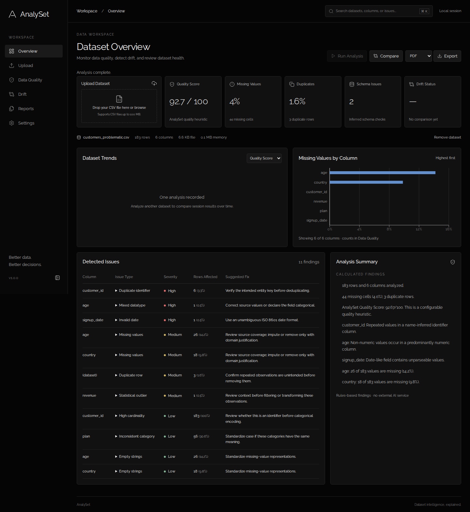

# AnalySet

AnalySet is an open-source dataset quality, profiling, validation, comparison and drift-analysis platform for analytics and machine-learning workflows.

## Overview

Upload a CSV, inspect calculated quality findings, compare a baseline with a current dataset, and export a printable report. Every result comes from the supplied data. The application uses deterministic statistical methods and needs no paid AI service or API key.

## Why AnalySet

Missing observations, repeated records, inconsistent values and shifting distributions can undermine dashboards and ML models. AnalySet makes these problems inspectable and explains its calculations so analysts can decide what to investigate. It flags candidates for review; it does not automatically clean or overwrite data.

## Features

- UTF-8 CSV upload and drag-and-drop with readable validation errors.
- Dataset and column profiling, missingness, uniqueness, finite numeric statistics, categorical counts and distributions.
- Exact duplicate rows, inferred identifier collisions, mixed types, invalid dates, infinities, constant columns and category case inconsistencies.
- Configurable IQR outliers and transparent weighted quality score.
- Baseline/current schema, quality, missingness, cardinality, outlier and distribution comparison.
- Numeric KS effect sizes and PSI; categorical Jensen-Shannon divergence.
- Session reports; PDF, JSON and spreadsheet-safe CSV issue exports.
- Dataset/column/issue search with Ctrl+K or Cmd+K; responsive dark workspace and keyboard controls.
- Local settings, sample datasets, automated backend/frontend/browser tests and CI.

## Screenshots

Actual application after analyzing `customers_problematic.csv`:



[Mobile dashboard](docs/images/dashboard-390.png)

## How It Works

1. Select a CSV or load the problematic customer sample.
2. Select **Run Analysis**. The backend validates CSV structure and profiles its actual values.
3. Review **Overview**, then **Data Quality** for column statistics and issue record examples.
4. Open **Drift**, choose baseline/current files or previous session analyses, and select **Compare datasets**.
5. Open a report through **Reports**, choose PDF/JSON/CSV, and select **Export**.

A single analysis does not create a fictitious history chart. Trends appear only after multiple analyses, in session order, and may represent different datasets.

## Architecture

React/Vite serves the interface. FastAPI validates uploads and settings. Pandas/NumPy profile values, SciPy compares distributions, and ReportLab creates PDFs. Reports and dataframes are held in a bounded, expiring server memory store, scoped by an unpredictable browser session identifier. Only analysis preferences persist in localStorage. No cloud database or user account is simulated.

See [architecture and deployment](docs/architecture.md) for data flow, resource limits and deployment boundaries.

## Technology Stack

| Layer | Technology |
| --- | --- |
| Interface | React, TypeScript, Vite, Tailwind CSS, Raleway |
| Charts and icons | Recharts, Lucide React |
| API and validation | Python, FastAPI, Pydantic |
| Analysis | Pandas, NumPy, SciPy |
| Reports | ReportLab |
| Verification | Pytest, Vitest, React Testing Library, Playwright, Ruff, ESLint, Prettier |

## Installation

Requirements: Git, Python 3.12, Node.js 22 LTS and npm. Dependency installation needs internet access. Run commands from the indicated directories. Python 3.12 is the tested interpreter; using a substantially newer Python can require different scientific-package wheels.

```sh
git clone https://github.com/YH189/analyset.git
cd analyset
```

## Quick Start

Start the backend in one terminal and the frontend in another using the commands below. Visit **http://localhost:5173**, then select **Load Sample Dataset**. API documentation is at **http://localhost:8000/docs**.

## Backend Setup

Windows PowerShell, starting from the repository root:

```powershell
cd backend
py -3.12 -m venv .venv
.\.venv\Scripts\python.exe -m pip install -r requirements.txt
.\.venv\Scripts\python.exe -m uvicorn app.main:app --reload
```

These commands use the virtual environment interpreter directly; changing PowerShell execution policy is unnecessary.

macOS/Linux:

```sh
cd backend
python3.12 -m venv .venv
.venv/bin/python -m pip install -r requirements.txt
.venv/bin/python -m uvicorn app.main:app --reload
```

## Frontend Setup

In a **second terminal**, starting from the repository root:

```sh
cd frontend
npm ci
npm run dev
```

The development server proxies `/api` to `http://127.0.0.1:8000`. Keep both processes running. If port 5173 is occupied, stop the conflicting process or explicitly configure the frontend origin in `CORS_ORIGINS`.

For production assets:

```sh
npm run build
```

Serve `frontend/dist` with a static web server. The Python API must be deployed separately or reverse-proxied on the same origin. Vite's development server is not the production hosting layer.

## Environment Variables

No environment file is required for the default local setup. `.env.example` lists supported values. Vite reads `frontend/.env.local`; Python reads operating-system environment variables, not the root `.env.example` automatically.

| Variable | Default | Purpose |
| --- | --- | --- |
| `VITE_API_BASE_URL` | empty | API origin; empty uses same-origin `/api` |
| `CORS_ORIGINS` | localhost and 127.0.0.1 on port 5173 | Explicit permitted browser origins, comma-separated |
| `MAX_UPLOAD_MB` | 100 | Per-file byte cap in MiB (UI labels MB) |
| `MAX_COLUMNS` | 500 | Width limit |
| `MAX_ROWS` | 1000000 | Row limit |
| `MAX_CELLS` | 5000000 | Parsed cell limit |
| `MAX_REPORTS` | 20 | Global in-memory report count |
| `REPORT_TTL_SECONDS` | 3600 | Expiration time |

PowerShell example: `$env:CORS_ORIGINS="https://your-frontend.example"` before starting the backend. Unix example: `export CORS_ORIGINS=https://your-frontend.example`. Set `VITE_API_BASE_URL` **before** building the frontend; Vite embeds it into public assets. Never place secrets in `VITE_` variables.

## Sample Datasets

| File | Demonstrates |
| --- | --- |
| `customers_clean.csv` | 180 rows without intentionally introduced quality problems |
| `customers_problematic.csv` | 183 rows, missing ages/countries, duplicate records, extreme revenue, mixed age, category case differences and invalid date |
| `customers_baseline.csv` | Same clean reference population, for repeatable comparison |
| `customers_drifted.csv` | Shifted age/revenue and country/plan frequencies, including new categories |

Samples are synthetic, deterministic and small. They are not real customer records. Sample endpoints use default quality settings; user-uploaded files use saved settings.

## Data Quality Methodology

Input must be comma-separated UTF-8, with one unique, nonempty header per column. Blank records and mismatched field counts are rejected. Duplicate headers are rejected before Pandas can rename them. Headerless numeric first records are detected heuristically; a textual first row cannot always be distinguished from genuine headers.

Whitespace is trimmed for profiling. Case-insensitive blank, `NA`, `N/A`, `null`, `none`, and `NaN` count as missing. This convention may need adaptation for domains where these are valid categories. Original strings remain available for exact duplicate detection.

A column is numeric when at least 80% of its nonmissing values parse numerically. Date-like names containing `date`, `timestamp` or `_at` invoke date validation; boolean and categorical types follow. This is inferred schema validation, not enforcement of a supplied business schema. Date inference is deliberately heuristic and ambiguous dates should be normalized to ISO 8601.

Issue details show up to ten **CSV record numbers**, with header numbered 1. These are logical records, not physical text lines for multiline quoted fields. Identifier checks use `id`/`_id` names. Range checks apply only to age (0–120), revenue, price and quantity (nonnegative). These are review heuristics, not universal constraints.

## Quality Score Formula

**AnalySet Quality Score** is a configurable heuristic, not an industry-standard measure or a guarantee that data is fit for use.

Let `N` be rows, `C` columns, `M` missing cells, `D` exact duplicate rows after the first, `I` invalid numeric/infinite/date cells, `K` consistency events and `S` columns with schema findings.

| Dimension | Formula | Default weight |
| --- | --- | --- |
| Completeness | `100 × (1 − M/(N×C))` | 30% |
| Uniqueness | `100 × (1 − D/N)` | 20% |
| Validity | `100 × (1 − I/(N×C))` | 20% |
| Consistency | `100 × (1 − min(K/(N×C), 1))` | 15% |
| Schema Health | `100 × (1 − S/C)` | 15% |

The final score is the sum of each component multiplied by its weight divided by 100. Components are clamped to 0–100 and rounded to three decimals; the final score is rounded to two decimals. Weights must total 100. Consistency events include nonmissing cells in mixed numeric/text categorical fields and case-variant category cells; these events can overlap. Schema findings include all-null, mixed-type, invalid-date and infinite-value columns. A column is counted once in `S`, although the overview issue count can include multiple findings per column.

Statistical outliers, constant fields, high cardinality and suspicious range heuristics are reported separately and do not directly reduce validity. Some dimensions intentionally overlap: an all-null column affects completeness and schema health. Adjust weights according to your workflow.

## Outlier Detection

IQR is the interquartile range: `Q3 − Q1`, the spread of the middle 50% of finite numeric observations. Pandas linear-interpolated quartiles define the bounds:

```text
lower = Q1 − multiplier × IQR
upper = Q3 + multiplier × IQR
```

The multiplier defaults to 1.5 and is configurable from 0.5 to 5. Values strictly outside the bounds are flagged. When IQR is zero, values differing from the common quartiles can be flagged. Numeric sample standard deviation uses `ddof=1`; a single finite observation is displayed with standard deviation 0 as an explicit application convention.

An outlier may be a valid rare event. Review its context before deletion, clipping or transformation.

## Data Drift Detection

Data drift means the distribution of current data differs from the baseline. It does not by itself prove degraded model performance, label drift or concept drift.

- **KS test:** SciPy's two-sample Kolmogorov-Smirnov calculation measures the largest separation (`D`) between numeric empirical cumulative distributions. Status uses `D`, an effect size. The unadjusted p-value is shown for context, not used to make a multiple-testing significance claim.
- **PSI:** Population Stability Index sums `(q − p) × log(q/p)` over baseline quantile bins. Baseline unique quantile edges plus infinite outer edges cover shifted values; a 0.5 pseudo-count avoids division by zero. PSI is descriptive and does not determine status.
- **Categorical:** Jensen-Shannon divergence uses base-2 logarithms and the full union of categories. It is the square of SciPy's Jensen-Shannon distance; 0 means identical proportions and 1 means disjoint distributions.

| Method | Standard Moderate threshold | High threshold |
| --- | --- | --- |
| Numeric KS D | 0.20 | 0.40 |
| Categorical JS divergence | 0.10 | 0.20 |

Sensitive multiplies thresholds by 0.7; relaxed by 1.3. At least 20 nonmissing observations per dataset are required; numeric values must also be finite. Numeric comparisons deterministically sample up to 10,000 values per side with seed 42. Overall status is the highest comparable column status. If no column is analyzable, the API's Low result is accompanied by zero analyzed columns and the UI explicitly warns that stability has not been established. Added/removed/type-changed fields are reported separately; dates and empty fields are not distribution-tested.

## Dataset Comparison

Analyze two files or choose existing reports. The comparison shows row/column changes, quality score, missing and duplicate rates, schema changes, column cardinality and outliers, issue counts and per-column distributions. Unexpected categories are current values absent from baseline; display lists are capped at 50. Numeric distribution charts display baseline-defined bins; categorical charts display the 15 largest combined-frequency categories, while the statistic uses all categories.

## API Overview

All dataset/report endpoints require an `X-Session-ID` header of 20–100 characters. The frontend generates an unpredictable UUID. This is session scoping, **not user authentication**.

| Method | Route | Purpose |
| --- | --- | --- |
| GET | `/api/health` | Health and version |
| POST | `/api/datasets/analyze` | Multipart `file` and JSON-string `settings` |
| POST | `/api/datasets/sample/{name}` | Analyze clean/problematic/baseline/drifted sample |
| GET | `/api/analysis/{id}` | Read session analysis |
| GET | `/api/report/{id}` | Read report analysis |
| POST | `/api/datasets/compare` | JSON baseline_id/current_id/sensitivity |
| POST | `/api/drift/analyze` | Same comparison contract |
| POST | `/api/report/{id}/export?format=pdf` | PDF, JSON or CSV download |

Error responses use `{"error":{"code":"...","message":"..."}}`. Validation errors are 422, size/resource errors 413, expired or foreign-session reports 404 and a busy analysis worker 429. Internal failures return a generic 500 message and log details server-side.

## Testing

Backend, from `backend` (PowerShell):

```powershell
.\.venv\Scripts\python.exe -m pytest -q
.\.venv\Scripts\ruff.exe check .
```

On macOS/Linux, replace those executables with `.venv/bin/python` and `.venv/bin/ruff`.

Frontend, from `frontend`:

```sh
npm run lint
npm run typecheck
npm run test
npm run format:check
npm run build
npx playwright install chromium
npm run test:e2e
```

On Windows, start the backend first using the setup commands; Playwright reuses a healthy local server. On Linux the Playwright configuration can launch the backend virtual environment itself. CI uses the installed Python interpreter. Browser tests exercise actual uploads, comparisons, PDF export, malformed input and all ten requested viewport sizes. JSDOM component tests use API mocks; those mocks are not included in the production app.

## GitHub Actions

`.github/workflows/ci.yml` installs dependencies, checks backend lint/tests and frontend lint/types/tests/build, then runs Chromium end-to-end tests on pushes and pull requests. A workflow definition is not evidence that a remote run passed; inspect the Actions tab for its actual result.

## Project Structure

```text
backend/app/       API, parsing, profiling, quality, drift and report modules
backend/tests/     Statistical and API regression tests
frontend/src/      App shell, components, lazy pages, typed API client and tests
frontend/e2e/      Playwright user journeys and responsive checks
sample-data/       Four reproducible customer CSVs
docs/              Architecture and validation notes
.github/workflows/ Automated quality checks
```

## Security

Uploads are treated only as text, never executed. The parser validates extension, MIME, encoding, dimensions and byte size; filenames are sanitized. Framework-spooled uploads are closed after processing. CSV exports prefix formula-like cells to reduce spreadsheet formula injection. PDF text is escaped. Secrets and generated dependencies are excluded from Git.

The default application is intended for local or trusted private use. Before exposing it publicly, add authenticated access, TLS, reverse-proxy request limits and rate limiting. Session identifiers alone are not a complete access-control system. CORS is not authentication. Use a single backend worker because the store is in memory; horizontal scaling requires a shared store and a job queue. Do not upload sensitive data to an untrusted deployment.

## Limitations

- 100 MB is a file acceptance cap, not a promise that every 100 MB CSV fits the row/cell/memory limits. String-heavy data can expand substantially in memory. Default aggregate retained dataframe budget is 512 MiB; one analysis runs at a time. Profiling also needs temporary working memory, so provision at least several GB for larger workloads.
- Reports expire after one hour, oldest reports can be evicted, and server restarts or browser refreshes remove workspace access. No cloud persistence is claimed.
- No supplied business-schema enforcement, user authentication, automatic remediation, database ingestion, XLSX/Parquet support, or paid LLM integration.
- Profiling uses inferred types and heuristic name rules. Numeric identifiers, mixed category codes and ambiguous dates need domain review. All-null datasets remain analyzable with prominent findings.
- Absolute numeric magnitudes above `1e150` are rejected with a rescaling message to prevent unstable statistics. PDF uses embedded Bitstream Vera fonts; glyph coverage is limited for some writing systems, while JSON/CSV preserve Unicode.
- Top categorical lists, histogram bins and issue record examples are bounded for display. PDF reports include column statistics and findings, not raw uploaded records.
- Distribution drift does not establish causation or model degradation. Multiple p-values are not corrected; status is based on documented effect thresholds.

## Interview Guide

**What problem does AnalySet solve?** It helps teams find and explain quality problems before trusting a dataset for analysis or ML.

**Why does quality matter?** Missingness can bias samples, duplicates can inflate counts, invalid values can break transformations, and changed distributions can undermine assumptions learned from historical data.

**How are missing values and duplicates found?** Explicit missing tokens are normalized, then Pandas `isna` counts missing cells. `DataFrame.duplicated()` flags exact repeated rows after the first occurrence. Identifier collisions use a separate name-based check.

**How do outliers and the score work?** IQR compares numeric values with bounds around the middle 50% of observations. The score combines five documented quality components; it does not classify every outlier as an error.

**How does drift work?** A baseline represents an earlier/reference population. Current columns are matched by name and inferred type, then KS compares numeric cumulative distributions and JS divergence compares categorical frequency vectors. PSI adds a binned numeric diagnostic. The UI also exposes schema and quality differences so drift can be interpreted alongside data problems.

## Roadmap

- Explicit user-supplied schema and domain validation rules.
- Authenticated deployments, durable report storage and background jobs.
- Streaming/chunked processing and broader file-format support.
- Model-aware monitoring, corrected hypothesis-testing workflows and configurable date formats.

## Contributing

Open an issue describing the problem or proposed improvement. Use a focused branch, keep calculations explainable, add regression coverage for analytical changes and run the documented checks before opening a pull request. Never commit datasets containing private information, secrets or generated dependency directories.

## License

MIT © 2026 YH189. See [LICENSE](LICENSE).

## AI-Assisted Development

AnalySet was developed using an AI-assisted software engineering workflow with OpenAI tools. The architecture, implementation, testing and documentation were developed iteratively with automated assistance and validation. The repository owner should review and study the code before relying on or presenting its behavior.
