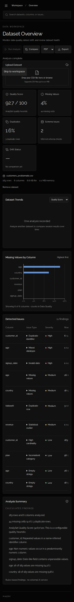
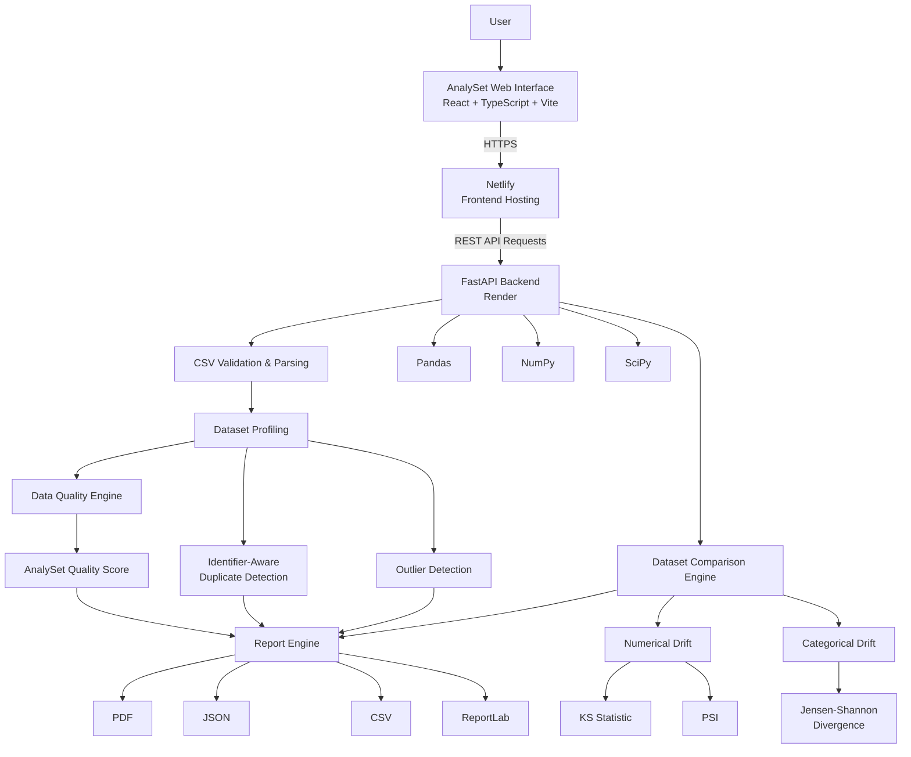
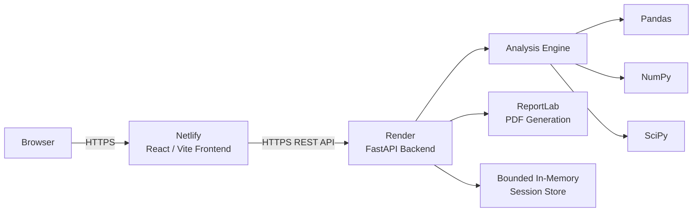
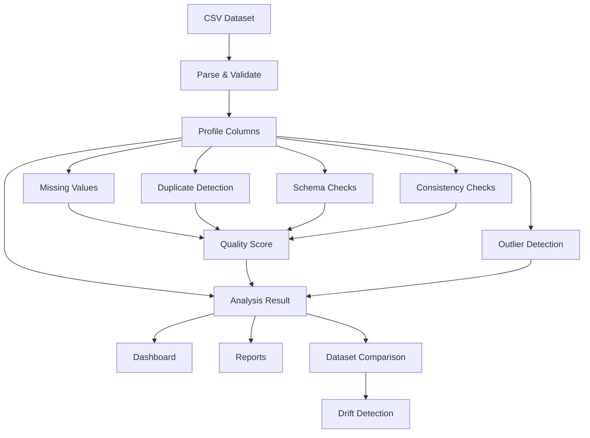
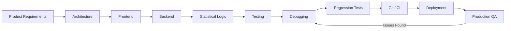
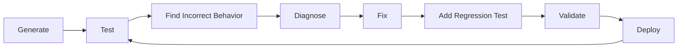

# AnalySet

> **An experimental production-style data application built end-to-end with GPT-6 Astra to evaluate how far autonomous AI-assisted software development can go.**

AnalySet is a full-stack dataset quality, profiling, validation, comparison, and statistical drift-analysis platform for analytics and machine-learning workflows.

Rather than using AI only for code completion, this project used **GPT-6 Astra as an autonomous software-engineering agent across the full development lifecycle** — architecture, frontend, backend, statistical logic, testing, debugging, documentation, Git workflows, deployment, and production troubleshooting.

The project was created specifically to test what an advanced AI system can build when given detailed product requirements, development tools, iterative human feedback, and responsibility for validating its own work.

---

## Live Application

**https://analyset.netlify.app**

## Project Status

| Area | Status |
|---|---|
| Frontend | Deployed |
| Backend API | Deployed |
| Dataset Analysis | Implemented |
| Data Quality Checks | Implemented |
| Identifier-Aware Duplicates | Implemented |
| Outlier Detection | Implemented |
| Dataset Comparison | Implemented |
| Statistical Drift Detection | Implemented |
| PDF / JSON / CSV Export | Implemented |
| Responsive UI | Implemented |
| Backend Tests | Implemented |
| Frontend Tests | Implemented |
| Browser / E2E Tests | Implemented |
| CI | GitHub Actions |
| Frontend Hosting | Netlify |
| Backend Hosting | Render |

---

# Why This Project Exists

AnalySet was not created primarily to claim that its source code was manually written.

It was created to investigate a different question:

> **How much of a real software-development lifecycle can an advanced AI system execute when given detailed requirements, development tools, iterative feedback, and responsibility for validating its own work?**

The project began with a product idea and detailed requirements.

GPT-6 Astra was then used extensively to:

- design the software architecture
- generate the React frontend
- implement the FastAPI backend
- build the dataset-analysis pipeline
- implement statistical calculations
- create API contracts
- write automated tests
- investigate bugs
- create regression tests
- iterate on the interface
- configure CI
- manage Git changes
- prepare documentation
- deploy the frontend
- deploy the backend
- troubleshoot production issues
- validate live application behavior

Human involvement remained important throughout the experiment.

The human role included:

- choosing the problem
- defining the product direction
- writing and refining requirements
- directing UX and visual decisions
- testing generated functionality
- identifying incorrect analytical behavior
- reporting bugs
- challenging implementation assumptions
- defining expected behavior
- requesting regression coverage
- reviewing production results
- deciding which changes were acceptable

This repository should therefore be understood as an **AI engineering experiment and autonomous-development case study**, rather than evidence that every implementation detail was manually authored.

---

# What AnalySet Does

AnalySet helps inspect the quality, structure, consistency, and distribution of CSV datasets before they are used in analytics or machine-learning workflows.

The basic workflow is:

```text
Upload Dataset
      │
      ▼
Validate CSV
      │
      ▼
Profile Dataset
      │
      ▼
Detect Quality Issues
      │
      ▼
Calculate Quality Score
      │
      ▼
Inspect Missing Values / Duplicates / Outliers
      │
      ▼
Compare Baseline and Current Data
      │
      ▼
Detect Statistical Drift
      │
      ▼
Review Findings
      │
      ▼
Export Report
```

---

# Core Features

## Dataset Profiling

AnalySet profiles uploaded CSV datasets and calculates information such as:

- row count
- column count
- inferred column types
- missing-value counts
- missing percentages
- unique-value counts
- cardinality
- numerical statistics
- categorical distributions
- minimum and maximum
- mean
- median
- standard deviation
- quartiles
- constant columns
- structural characteristics

---

## Data Quality Analysis

The analysis engine can identify:

- missing values
- empty columns
- duplicate records
- identifier-aware duplicate business records
- mixed data types
- invalid dates
- infinite numerical values
- suspicious ranges
- constant fields
- category-case inconsistencies
- schema-related problems
- numerical outliers

Findings are surfaced for investigation rather than automatically modifying the uploaded data.

---

# Identifier-Aware Duplicate Detection

A conventional duplicate check compares every column in a row.

That can miss duplicate **business records** when datasets contain unique identifiers.

For example:

```text
customer_id    name    age    plan
1007           Sam     30     Pro
1008           Sam     30     Pro
```

These records contain the same business information but different auto-generated IDs.

AnalySet includes identifier-aware duplicate detection that can exclude identifier-like columns from duplicate matching where appropriate.

The system supports:

- automatic identifier detection
- identifier-name heuristics
- uniqueness-based identifier heuristics
- exclusion reasons
- force-include overrides
- force-exclude overrides
- duplicate-group reporting
- matched-column reporting
- excluded-column reporting
- regression tests for identifier-aware matching

This feature was introduced after live testing exposed a limitation in the original full-row equality implementation.

---

# AnalySet Quality Score

AnalySet calculates an explainable quality heuristic between `0` and `100`.

The score is **not claimed to be an industry-standard data-quality metric**.

The default weighting is:

| Dimension | Weight |
|---|---:|
| Completeness | 30% |
| Uniqueness | 20% |
| Validity | 20% |
| Consistency | 15% |
| Schema Health | 15% |
| **Total** | **100%** |

Conceptually:

```text
Quality Score =
(Completeness × 0.30)
+ (Uniqueness × 0.20)
+ (Validity × 0.20)
+ (Consistency × 0.15)
+ (Schema Health × 0.15)
```

The scoring methodology is intentionally transparent so users can understand what contributes to the final result.

Weights can be adjusted according to the analysis context.

---

# Outlier Detection

Numerical outliers are detected using the **Interquartile Range (IQR)** method.

```text
IQR = Q3 - Q1

Lower Bound = Q1 - multiplier × IQR

Upper Bound = Q3 + multiplier × IQR
```

The default multiplier is:

```text
1.5
```

The multiplier can be configured.

Values outside the bounds are flagged for review.

An outlier is not automatically considered invalid. Rare but legitimate observations may also be statistical outliers.

---

# Data Drift Detection

AnalySet can compare a baseline dataset with a current dataset to determine whether their statistical distributions have changed.

## Numerical Drift

Numerical columns can be evaluated using:

- Kolmogorov-Smirnov statistic
- Population Stability Index

## Categorical Drift

Categorical distributions can be evaluated using:

- Jensen-Shannon divergence
- category-frequency changes

Drift findings are summarized into understandable severity levels such as:

```text
Low
Moderate
High
```

Column-level findings remain available so the overall result can be investigated.

Data drift does not automatically imply model-performance degradation or concept drift.

---

# Dataset Comparison

Baseline and current datasets can be compared across:

- row counts
- column counts
- quality scores
- missing-value rates
- duplicate rates
- schema changes
- added columns
- removed columns
- datatype changes
- cardinality
- numerical distributions
- categorical distributions
- outlier counts
- statistical drift

---

# Reports and Export

Analysis results can be exported as:

- PDF
- JSON
- CSV issue reports

Reports provide a portable representation of dataset-analysis findings.

---

# User Interface

AnalySet uses a compact, dark analytical interface designed for technical workflows.

The visual system uses:

- near-black backgrounds
- charcoal-grey panels
- restrained borders
- Raleway typography
- lightweight icons
- compact information density
- thin analytical chart lines
- restrained use of accent colors
- responsive layouts
- keyboard-accessible controls
- minimal decorative effects

The interface intentionally avoids a highly stylized AI-dashboard aesthetic.

---

# Screenshots

## Dataset Overview


## Mobile



---

# System Architecture



---

# Deployment Architecture



---

# Analysis Pipeline



---

# Technology Stack

| Layer | Technology |
|---|---|
| Frontend | React |
| Language | TypeScript |
| Build Tool | Vite |
| Styling | Tailwind CSS |
| Typography | Raleway |
| Charts | Recharts |
| Icons | Lucide React |
| Backend | FastAPI |
| Backend Language | Python |
| Validation | Pydantic |
| Data Processing | Pandas |
| Numerical Computing | NumPy |
| Statistics | SciPy |
| Reports | ReportLab |
| Backend Testing | Pytest |
| Frontend Testing | Vitest |
| Component Testing | React Testing Library |
| E2E Testing | Playwright |
| Python Linting | Ruff |
| Frontend Linting | ESLint |
| Formatting | Prettier |
| CI | GitHub Actions |
| Frontend Hosting | Netlify |
| Backend Hosting | Render |
| Source Control | Git + GitHub |

---

# Repository Structure

```text
analyset/
│
├── backend/
│   ├── app/
│   │   ├── analysis/
│   │   ├── api/
│   │   ├── drift/
│   │   ├── profiling/
│   │   ├── quality/
│   │   ├── reports/
│   │   ├── schemas/
│   │   └── services/
│   │
│   └── tests/
│
├── frontend/
│   ├── public/
│   ├── src/
│   │   ├── components/
│   │   ├── charts/
│   │   ├── hooks/
│   │   ├── lib/
│   │   ├── pages/
│   │   ├── services/
│   │   ├── styles/
│   │   └── types/
│   │
│   └── e2e/
│
├── sample-data/
│   ├── customers_clean.csv
│   ├── customers_problematic.csv
│   ├── customers_baseline.csv
│   └── customers_drifted.csv
│
├── docs/
│
├── .github/
│   └── workflows/
│
├── .env.example
├── .gitignore
├── LICENSE
└── README.md
```

---

# Sample Datasets

The repository includes synthetic datasets for repeatable testing.

| Dataset | Purpose |
|---|---|
| `customers_clean.csv` | Relatively clean reference dataset |
| `customers_problematic.csv` | Data-quality problems |
| `customers_baseline.csv` | Baseline distribution |
| `customers_drifted.csv` | Intentional numerical and categorical drift |

The problematic dataset includes intentionally introduced examples such as:

- missing values
- duplicate business records
- extreme values
- inconsistent categories
- datatype problems
- invalid dates

The datasets are synthetic and do not contain real customer records.

---

# Running Locally

## Requirements

- Git
- Python 3.12
- Node.js 22+
- npm

Clone the repository:

```bash
git clone https://github.com/YH189/analyset.git
cd analyset
```

---

## Backend

### Windows PowerShell

```powershell
cd backend

py -3.12 -m venv .venv

.\.venv\Scripts\python.exe -m pip install -r requirements.txt

.\.venv\Scripts\python.exe -m uvicorn app.main:app --reload
```

Backend:

```text
http://localhost:8000
```

API documentation:

```text
http://localhost:8000/docs
```

---

## Frontend

Open another terminal:

```bash
cd frontend

npm ci

npm run dev
```

Frontend:

```text
http://localhost:5173
```

During development, the Vite server proxies `/api` requests to the local FastAPI backend.

---

# Environment Variables

## Frontend

```text
VITE_API_BASE_URL
```

Production API origin:

```text
https://analyset-api.onrender.com
```

## Backend

Supported configuration includes:

```text
CORS_ORIGINS
MAX_UPLOAD_MB
MAX_COLUMNS
MAX_ROWS
MAX_CELLS
MAX_REPORTS
REPORT_TTL_SECONDS
```

See `.env.example` for configuration details.

Never place secrets in variables beginning with `VITE_`, because Vite embeds those values into frontend assets.

---

# Testing

## Backend

From `backend/`:

```bash
pytest -q
ruff check .
```

---

## Frontend

From `frontend/`:

```bash
npm run lint
npm run typecheck
npm run test
npm run format:check
npm run build
```

---

## Browser / End-to-End Testing

```bash
npx playwright install chromium
npm run test:e2e
```

Browser tests cover major workflows such as:

- dataset upload
- sample dataset loading
- analysis execution
- data-quality views
- dataset comparison
- drift analysis
- report generation
- PDF export
- malformed input handling
- responsive layouts

---

# Continuous Integration

GitHub Actions is configured to validate the application on pushes and pull requests.

The CI pipeline includes:

```text
Backend
 ├─ Ruff
 └─ Pytest

Frontend
 ├─ ESLint
 ├─ TypeScript
 ├─ Vitest
 └─ Production Build

Browser
 └─ Playwright
```

Workflow configuration:

```text
.github/workflows/ci.yml
```

---

# Deployment

## Frontend

The React/Vite frontend is deployed through Netlify:

**https://analyset.netlify.app**

## Backend

The FastAPI service is deployed through Render:

**https://analyset-api.onrender.com**

API health endpoint:

**https://analyset-api.onrender.com/api/health**

Production flow:

```text
Browser
   │
   ▼
Netlify
React / Vite
   │
   │ HTTPS API
   ▼
Render
FastAPI
   │
   ▼
Pandas / NumPy / SciPy
```

---

# Security

Uploaded files are treated as data and are never executed as code.

The application includes safeguards such as:

- upload-size limits
- row limits
- column limits
- cell-count limits
- filename sanitization
- explicit CORS configuration
- bounded report/session storage
- CSV export safeguards
- generic server-side error responses
- controlled analysis concurrency

The public demo should only be used with:

- synthetic datasets
- sample datasets
- non-sensitive datasets

Do **not** upload confidential, regulated, private, or otherwise sensitive data to the public deployment.

The application does not currently provide user-account authentication.

---

# Known Limitations

AnalySet is an experimental application rather than a commercial data-governance platform.

Current limitations include:

- CSV-focused ingestion
- no database connectors
- no permanent cloud report storage
- no user-account authentication
- reports stored temporarily in server memory
- heuristic schema inference
- no automatic data cleaning
- no supplied domain/business schema
- statistical findings require human interpretation
- single-service in-memory architecture limits horizontal scaling

These limitations are documented intentionally rather than hidden.

---

# GPT-6 Astra Experiment

## Development Model

AnalySet was built specifically as an experiment in **autonomous AI-assisted software engineering using GPT-6 Astra**.

The model was used beyond simple autocomplete or isolated code generation.

It participated across the development lifecycle:



The experiment therefore evaluates whether an AI system can maintain context and improve a real application iteratively across multiple engineering disciplines.

---

# Human vs AI Contribution

## GPT-6 Astra

GPT-6 Astra was used extensively for:

- architecture
- frontend implementation
- backend implementation
- API design
- statistical algorithms
- data-quality logic
- drift analysis
- automated tests
- regression tests
- debugging
- responsive implementation
- deployment configuration
- Git changes
- CI configuration
- technical documentation
- production troubleshooting

## Human Direction

The human operator was responsible for:

- selecting the project
- defining the product goal
- specifying requirements
- directing visual design
- evaluating output
- testing actual application behavior
- identifying incorrect results
- reporting bugs
- defining expected behavior
- challenging implementation decisions
- requesting corrections
- reviewing live deployments
- deciding when functionality was acceptable

This distinction is intentional.

> **AnalySet is not presented as a project whose code was manually authored line-by-line by the repository owner. It is presented as an experiment in directing, evaluating, testing, and iterating with an autonomous AI software-engineering system.**

---

# Example: AI-Generated Code Still Required Validation

One of the most useful findings from the project occurred during duplicate detection.

The original implementation relied on full-row equality.

That meant records such as:

```text
customer_id    name    age    plan
1007           Sam     30     Pro
1008           Sam     30     Pro
```

were considered different because `customer_id` differed.

From a business-record perspective, however, the rows were duplicates.

Testing exposed the problem.

The duplicate engine was subsequently redesigned with:

- identifier-aware matching
- identifier heuristics
- automatic exclusion
- explicit overrides
- duplicate-group reporting
- regression tests

The development cycle therefore became:



This is an important outcome of the experiment.

> **AI-generated software still requires validation.**

Generating working code once is different from engineering a reliable system through repeated testing and correction.

---

# What This Experiment Demonstrates

AnalySet explores the practical use of autonomous AI across:

- product interpretation
- full-stack development
- data engineering concepts
- statistical software
- automated testing
- regression testing
- debugging
- source control
- CI
- deployment
- production validation
- technical documentation

It also demonstrates limitations.

AI-generated implementations can contain assumptions that appear reasonable in code but fail against real application behavior.

Human evaluation and independent testing remain important parts of the engineering process.

---

# Experiment Findings

Several conclusions emerged during development:

### 1. AI can execute substantial multi-step engineering work

GPT-6 Astra was able to work across frontend, backend, statistics, testing, source control, deployment, and documentation within one project.

### 2. Detailed requirements materially improve results

Precise expected behavior produced more reliable implementations than broad requests such as "build a data-quality app."

### 3. Production testing catches problems static code generation does not

Several issues became clear only when the real application or deployment was tested.

### 4. Regression tests are especially important in AI-assisted development

When a generated implementation failed, encoding the failure as a regression test helped prevent the same mistake from returning.

### 5. Human direction remains important

The AI could implement and diagnose many problems, but product judgment, expected behavior, and acceptance criteria still required human decisions.

### 6. AI-assisted development is more useful as an iterative loop than one-shot generation

The most effective workflow was:

```text
Specify
   ↓
Generate
   ↓
Test
   ↓
Inspect
   ↓
Correct
   ↓
Regression Test
   ↓
Deploy
   ↓
Validate
   ↺
```

---

# Project Goal

The purpose of AnalySet is **not** to claim:

> "AI can replace software engineers."

The experiment asks a narrower and more useful question:

> **How far can an advanced AI system execute a real software-development lifecycle when provided with tools, detailed requirements, continuous feedback, and responsibility for validating its work?**

AnalySet is the resulting experiment.

---

# Future Experiments

Potential extensions include:

- PostgreSQL-backed persistent storage
- Parquet support
- Excel ingestion
- authenticated workspaces
- background analysis jobs
- shared job queues
- larger dataset processing
- supplied schema contracts
- custom business-quality rules
- dataset versioning
- richer data observability
- column lineage
- model-monitoring workflows
- concept-drift analysis
- LLM-assisted explanations
- evaluation of future autonomous coding models against the same project

---

# Disclaimer

AnalySet provides statistical and heuristic findings intended for investigation.

It does not establish whether a dataset is legally, financially, scientifically, medically, or operationally valid.

Statistical findings must be interpreted in the context of the underlying data and domain.

---

# License

MIT License.

See [`LICENSE`](LICENSE).

---

# Author & Experiment Direction

Repository maintained by **YH189**.

AnalySet was developed as an experimental autonomous AI-assisted engineering project using **GPT-6 Astra**, under human product direction, testing, review, and iterative feedback.

---

# Links

### Live Application

https://analyset.netlify.app

### Backend API

https://analyset-api.onrender.com

### Repository

https://github.com/YH189/analyset
